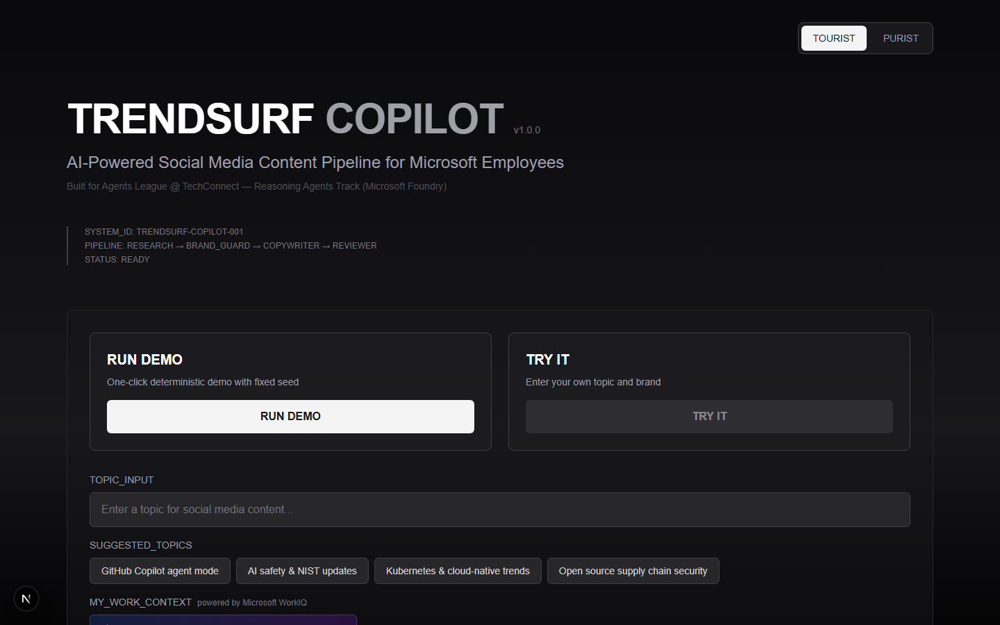
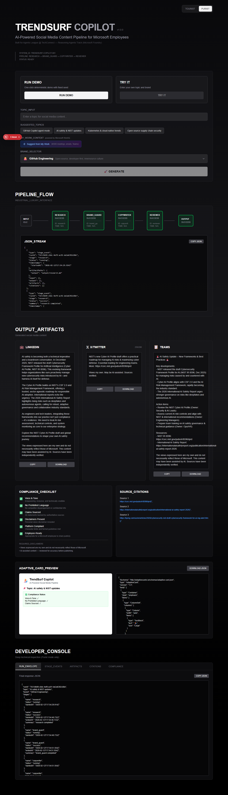

<div align="center">

# 🏄 TrendSurf Copilot

**Turn what you're already working on into social media posts — aligned with Microsoft's voice.**

</div>

---

## What is TrendSurf?

TrendSurf Copilot is a multi-agent AI pipeline that helps Microsoft employees create social media content. It connects to your Microsoft 365 data through **WorkIQ** to surface topics from your meetings, emails, and Teams chats — then runs those topics through a 4-agent pipeline that researches trends, checks brand compliance, writes platform-specific posts, and reviews them before you hit publish.

**The result:** LinkedIn, X/Twitter, and Teams posts grounded in real sources that match your team's voice — in about a minute.

---

## Quick Start

### Prerequisites

- **Node.js 18+** and npm
- **Python 3.10+** with `pip`
- **Azure CLI** — logged in (`az login`)
- An Azure subscription with a Foundry project and Bing Search resource

### Setup

```bash
# Clone and install Python deps
cd trendsurf-copilot
python -m venv .venv
.venv\Scripts\activate          # Windows
pip install -r requirements.txt

# Install web UI deps
cd web
npm install

# Copy environment config
copy .env.example .env          # then edit with your Foundry endpoint
```

### Run

```bash
cd web
npm run dev
# Open http://localhost:3000
```

---

## How It Works

### 1. Pick a topic

When you land on the app, you'll see suggested topic chips and a text input. Type any topic, or click a chip to pre-fill it.


### 2. Suggest from My Work (WorkIQ)

Click **"Suggest from My Work"** to pull topic suggestions directly from your Microsoft 365 data — meetings, emails, and Teams chats from the past week. WorkIQ queries your M365 Copilot data and returns the themes you've been most involved with as clickable blue chips.



> **How WorkIQ works:** The app calls the `@microsoft/workiq` CLI under the hood, which queries your M365 Copilot data using your Entra auth. Topics like "Customer Zero initiative updates," "Agentic AI & Copilot agents," or whatever you've been discussing in meetings show up as one-click suggestions. No manual topic brainstorming needed.

### 3. Choose a brand voice

Pick from **10 brand presets** covering Microsoft and GitHub advocacy areas — GitHub Engineering, Microsoft AI, Azure DevOps, GitHub Copilot, Microsoft Security, and more. Each preset sets the tone, audience, and voice for the generated posts.

### 4. Watch the pipeline run

Hit **Generate** and the 4-agent pipeline kicks off. You'll see each stage light up in real time:


| Agent | What it does |
|-------|-------------|
| **Research** | Searches the web via Bing for authoritative sources on your topic |
| **Brand Guard** | Checks the research against Microsoft employee social media guidelines |
| **Copywriter** | Writes LinkedIn, X/Twitter, and Teams posts in your selected brand voice |
| **Reviewer** | Self-critiques all posts for accuracy, tone, length, and compliance |

### 5. Get your posts

Results appear as ready-to-use post cards with copy and download buttons. Each post includes character counts (Twitter 280-char limit), compliance checklist, and source citations.


### 6. Inspect everything (Purist Mode)

Toggle to **Purist Mode** for full pipeline transparency — live JSON streams, stage events, run envelopes, and a developer console with tabs for artifacts, citations, and compliance deltas.



---

## WorkIQ Integration

WorkIQ connects TrendSurf to your Microsoft 365 data so you post about what you're actually working on.

### What it does
- Queries your recent **meetings, emails, Teams chats, and documents** via M365 Copilot
- Returns the **top 5 professional themes** you've been involved with
- Surfaces them as **blue ⚡ chips** you can click to start the pipeline

### Setup
WorkIQ uses your Entra ID authentication. First-time setup:

```bash
# Accept the EULA (one-time)
npx -y @microsoft/workiq accept-eula

# Verify it works (will open browser for auth if needed)
npx -y @microsoft/workiq ask -q "What are my top meeting topics this week?"
```

After the first auth, your session is cached and the app handles everything automatically.

### Requirements
- Your tenant needs **M365 Copilot** enabled
- Admin consent for the WorkIQ Entra app (ask your tenant admin)
- You must be signed in with your `@microsoft.com` identity

---

## Brand Presets

| Preset | Voice | Audience |
|--------|-------|----------|
| 🐙 GitHub Engineering | Technical, community-driven, transparent | Developers, OSS maintainers |
| 🤖 Microsoft AI | Authoritative, inclusive, innovation-forward | AI/ML engineers, CTOs |
| ☁️ Azure DevOps | Practical, solution-oriented | Platform engineers, SREs |
| 🔒 GitHub Advanced Security | Urgent but empowering, shift-left | AppSec teams, CISOs |
| 💻 Microsoft Developer Division | Friendly, pragmatic, code-first | Full-stack developers |
| ✨ GitHub Copilot | Inspiring, evidence-based | Software engineers, startups |
| 🛡️ Microsoft Security | Authoritative, risk-aware | CISOs, SOC analysts |
| 🌍 GitHub Community & Advocacy | Inclusive, celebratory | Student devs, MVPs |
| 🌱 Microsoft Sustainability | Mission-driven, data-backed | ESG leads, policy makers |
| 🏦 FinGuard Capital (Demo) | Professional, compliance-first | Sample fintech vertical |

---

## Architecture

```
                    ┌──────────────────────────┐
                    │  Microsoft 365 (WorkIQ)  │
                    │  meetings · emails · Teams│
                    └────────────┬─────────────┘
                                 │ topic suggestions
                                 ▼
User ────▶ Topic + Brand ────▶ Pipeline
                                 │
          ┌──────────────────────┼──────────────────────┐
          │                      │                       │
          ▼                      ▼                       ▼
    📡 Research            🛡️ Brand Guard          ✍️ Copywriter
    (Bing Search)          (Vector Store)          (Platform posts)
                                                        │
                                                        ▼
                                                  🔍 Reviewer
                                                  (Self-Reflect)
                                                        │
                                                        ▼
                                              LinkedIn · X · Teams
                                              + Compliance + Sources
```

---

## Testing

```bash
cd web

# Run all E2E tests
npm run test:e2e

# Run with browser visible
npm run test:e2e:headed

# Run with Playwright UI
npm run test:e2e:ui
```

The tests validate the full flow — landing page, pipeline stages, post generation, compliance checklist, source citations, mode toggle, and topic input.

---

## Project Structure

```
trendsurf-copilot/
├── agents/                    # Python agent definitions
│   ├── agent_factory.py       # Agent creation & lifecycle
│   └── prompts.py             # System prompts for all 4 agents
├── data/
│   ├── brand_kit.md           # Microsoft employee social media guidelines
│   └── adaptive_card_template.json
├── web/                       # Next.js web UI
│   ├── app/
│   │   ├── page.tsx           # Main app page
│   │   └── api/
│   │       ├── generate/      # POST — runs the pipeline
│   │       ├── workiq/        # POST — queries M365 via WorkIQ
│   │       └── runs/[runId]/events/  # GET — SSE stage stream
│   ├── components/            # React components
│   ├── tests/e2e.spec.ts      # Playwright E2E tests
│   └── screenshots/           # Auto-captured test screenshots
├── output/                    # Generated content
├── main.py                    # CLI pipeline orchestrator
└── requirements.txt
```

---

## CLI Usage

You can also run the pipeline from the command line without the web UI:

```bash
python main.py
python main.py "GitHub Copilot agent mode and AI-assisted development"
```

Results are saved to `output/` as markdown files and a JSON artifact.

---

*Built with Microsoft Foundry, Bing Search, WorkIQ, and GitHub Copilot*
